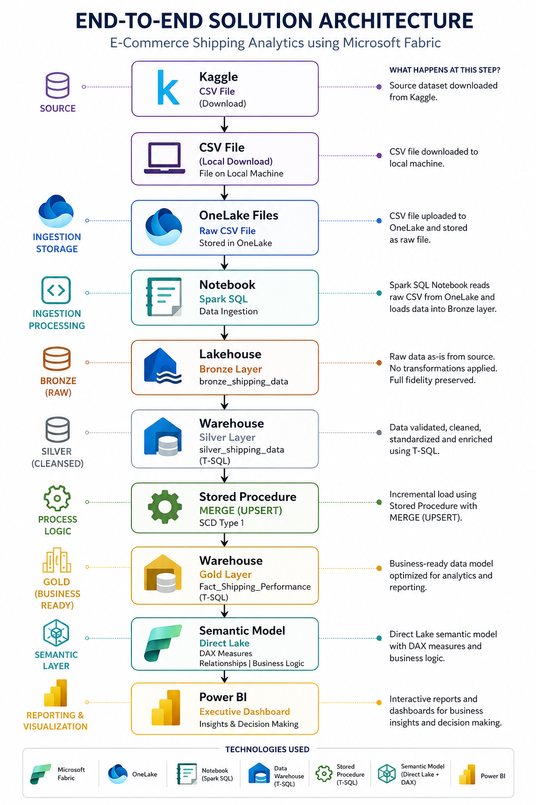
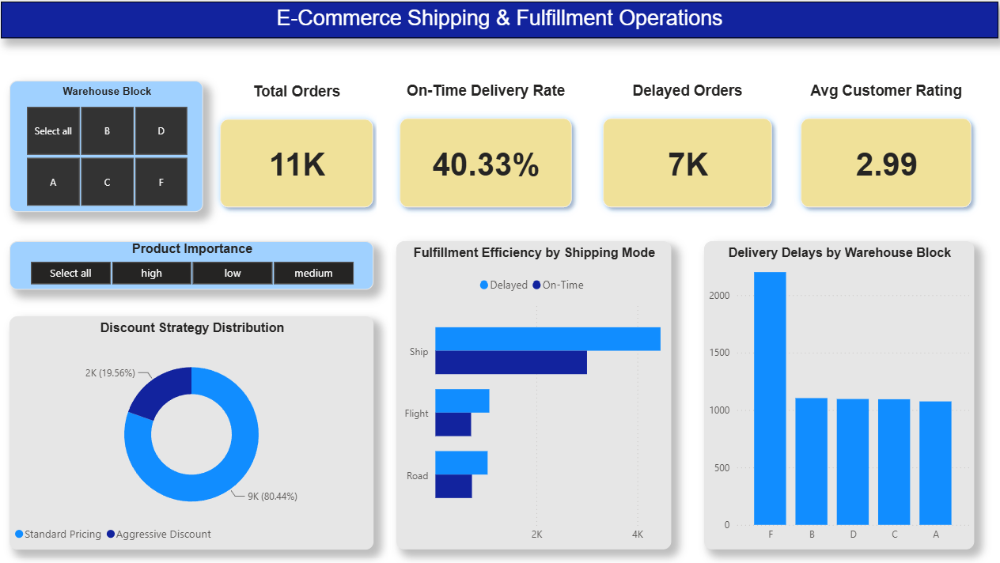

# End-to-End E-Commerce Shipping Analytics using Microsoft Fabric

This project demonstrates an end-to-end data engineering and analytics solution built in Microsoft Fabric using the **E-Commerce Shipping Data** dataset from Kaggle.

The solution follows a streamlined Medallion Architecture (Bronze → Silver → Gold) to transform raw shipping data into reliable, business-ready information that supports operational reporting and business decision-making.

Instead of redesigning the dataset into a traditional star schema, this project preserves its existing denormalized structure and implements a single Gold Fact table optimized for analytics, Direct Lake performance, and Power BI reporting.

---

## Project Highlights

- End-to-end Microsoft Fabric implementation
- Medallion Architecture (Bronze → Silver → Gold)
- Spark SQL for data ingestion
- T-SQL for data transformation and business logic
- Incremental loading using Stored Procedure and MERGE (UPSERT / SCD Type 1)
- Microsoft Fabric Data Pipelines
- Power BI Semantic Model (Direct Lake)
- DAX Measures
- Row-Level Security (RLS)
- Executive Fulfillment & Operations Dashboard

---

## Architecture



---

## Executive Dashboard



---

## Repository Structure

```text
01_project_documentation/
02_architecture/
03_data/
04_source_code/
05_power_bi/
```

---

## Documentation

Project documentation is organized into individual documents covering every stage of the solution.

- Project Overview
- Business Problem
- Business Objectives
- Dataset
- Implementation Workflow
- Project Scope
- Tools & Technologies
- Data Dictionary
- Engineering Design Decisions
- Lessons Learned
- Project Summary

---

## Technologies

| Category | Technology |
|-----------|------------|
| Platform | Microsoft Fabric |
| Storage | OneLake |
| Data Storage | Lakehouse |
| Data Warehouse | Fabric Data Warehouse |
| Data Ingestion | Spark SQL |
| Data Transformation | T-SQL |
| Pipeline | Microsoft Fabric Data Pipelines |
| Semantic Layer | Power BI Semantic Model (Direct Lake) |
| Reporting | Power BI |
| Analytics | DAX |

---

## Project Outcome

This project demonstrates how Microsoft Fabric can be used to build a complete analytics solution-from raw data ingestion through business reporting, using practical engineering techniques that reflect modern enterprise data platform development.

Although the dataset itself is intentionally simple, the engineering approach, implementation decisions, and documentation establish a repeatable framework that will be expanded in future projects using larger datasets, more complex data models, and broader business scenarios.
